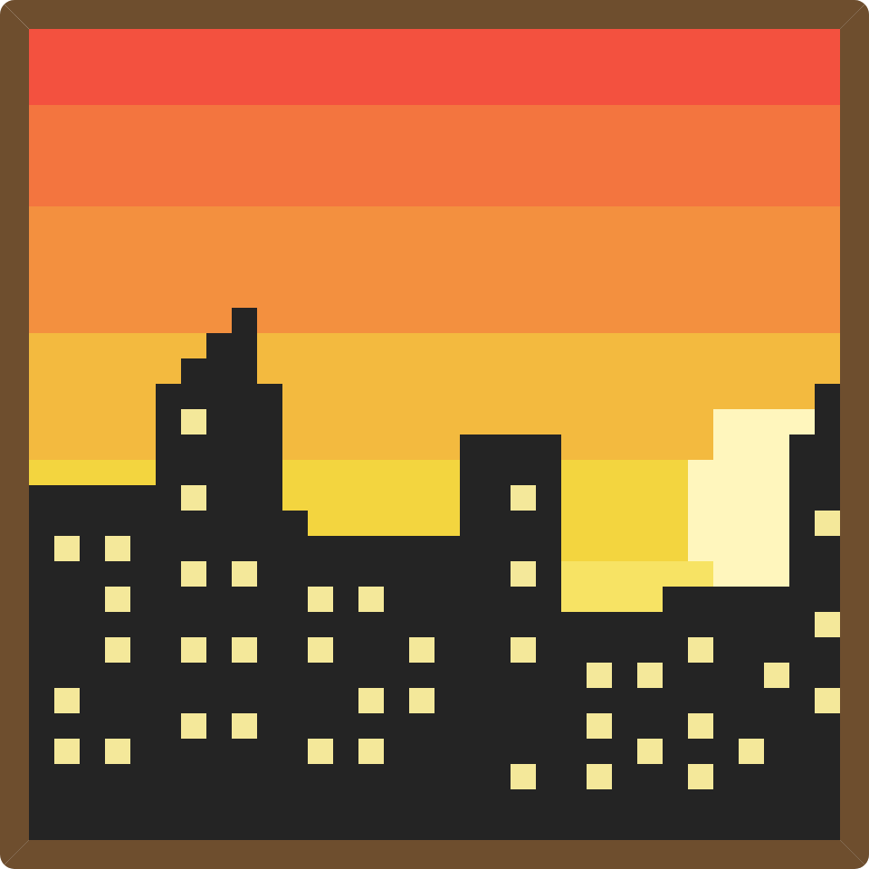
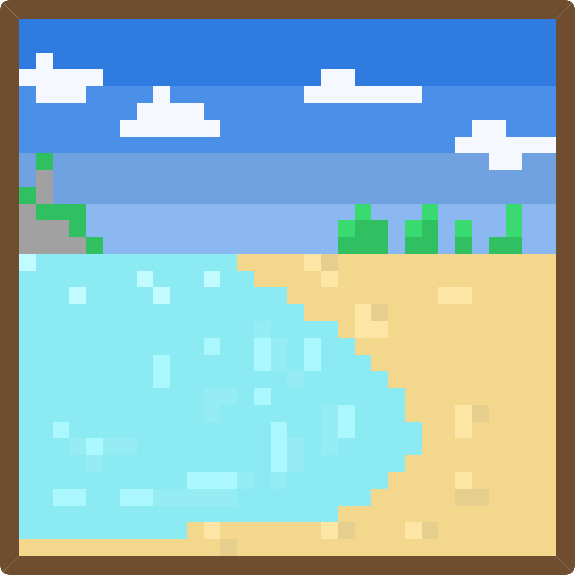
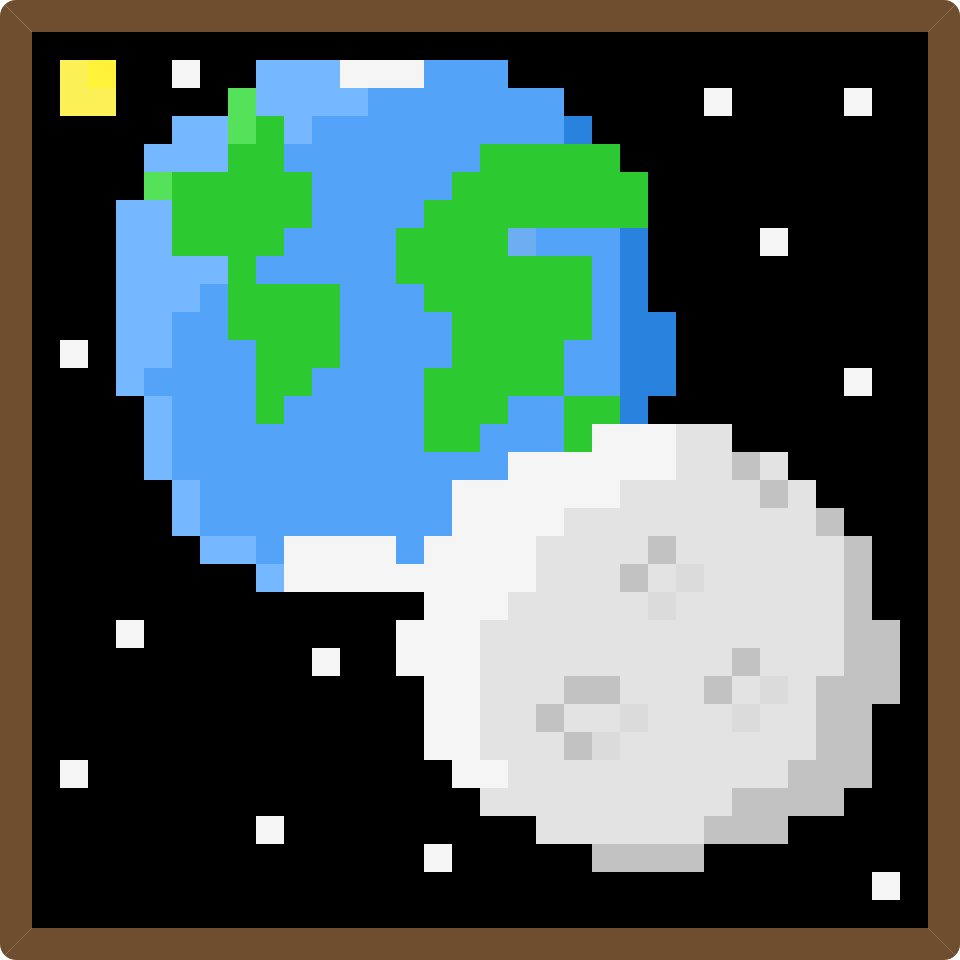
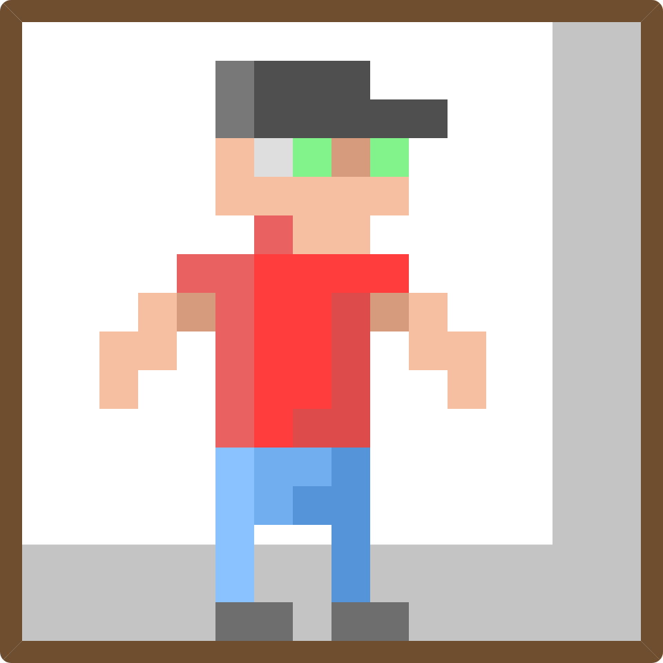

# RetroFrame

A website to make your pixel art and show it to the world!

Access the deploy here: [jonas-petty.github.io/RetroFrame/](jonas-petty.github.io/RetroFrame/)

## Preview:

|                                       |                                       |
| ------------------------------------- | ------------------------------------- |
|  |  |
|  |  |

## Tools:

-   HTML
-   CSS
-   JavaScript
-   DOM manipulation
-   html2canvas (to export the image as png)

## Features:

-   Intuitive drawing experience
-   Choose any color
-   Alternate Grid visibility
-   Resize Grid to maximum of 100x100 pixels
-   Erase pressing the erase button (or holding shift key)
-   Reset painting
-   Export as PNG image

## Future improviments:

-   Update mobile layout and functionality
-   Update overall design
-   Improve accessibility
-   Export as different formats

## Contact

- LinkedIn: [https://www.linkedin.com/in/jonas-felix-dev/](https://www.linkedin.com/in/jonas-felix-dev/)
- Email: [jonasfelixdesouza21@gmail.com](jonasfelixdesouza21@gmail.com)
